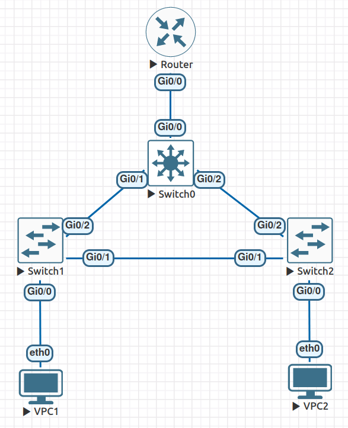
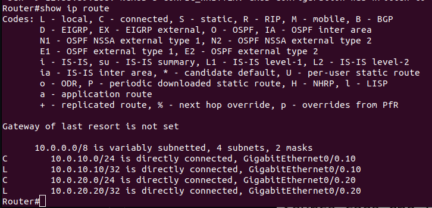
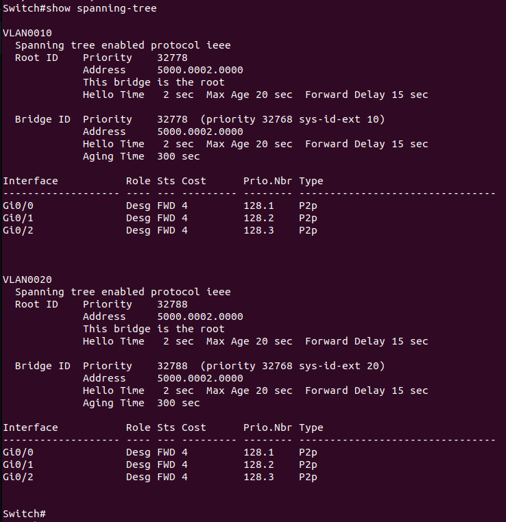
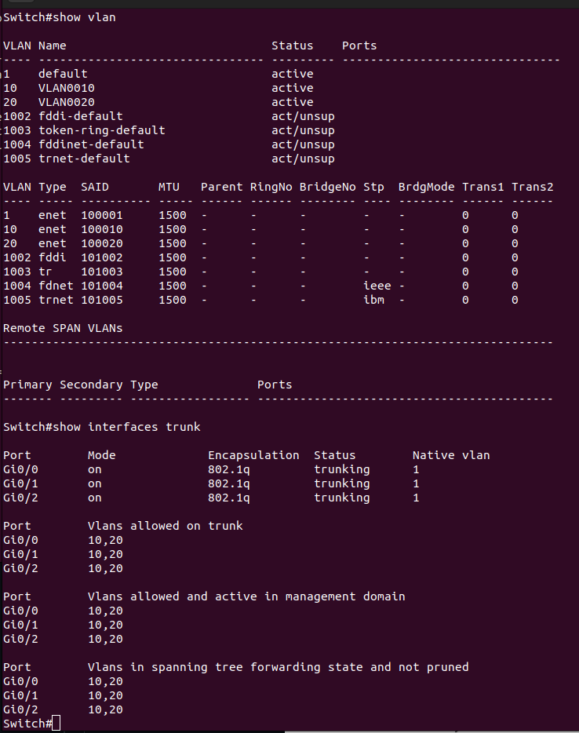
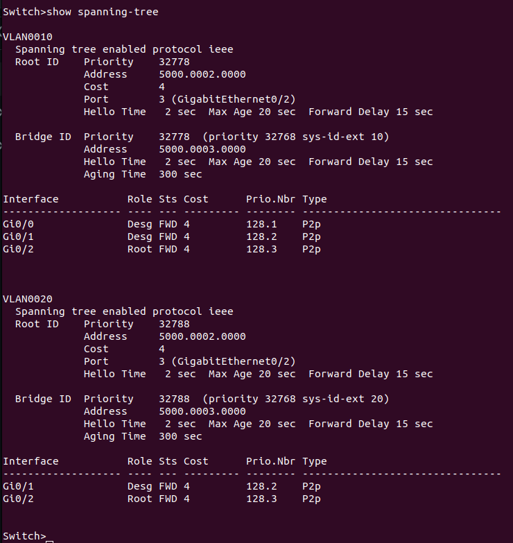
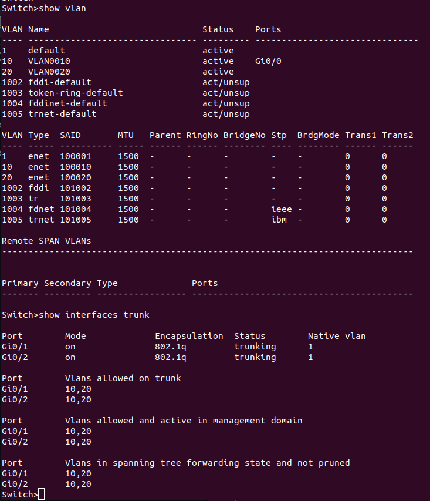
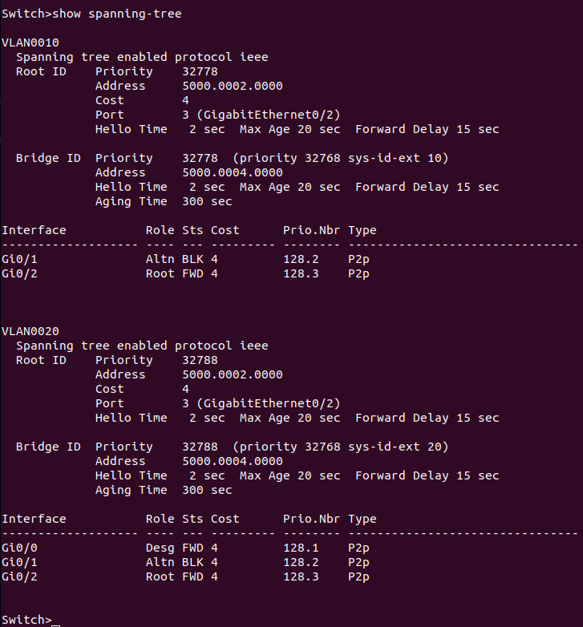
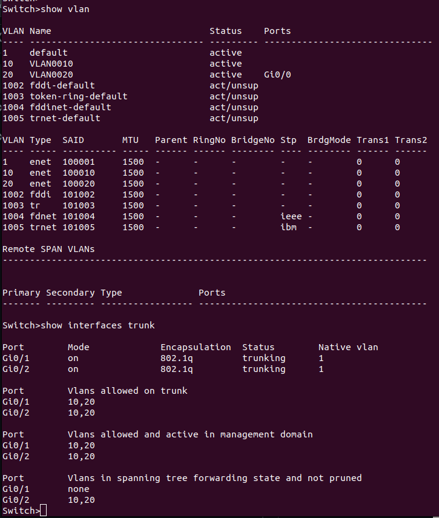
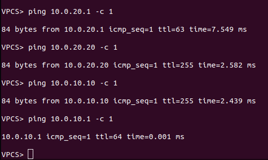
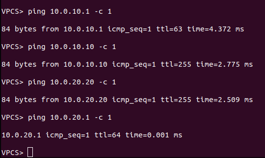

# Lab 1

ДЗ сделана на полный балл, все конфиги системы лежат в config/

### Полученная топология:



### Настройка системы:

### Router

```
enable
configure terminal
interface GigabitEthernet0/0
no shutdown
exit
interface GigabitEthernet0/0.10
encapsulation dot1q 10
ip add 10.0.10.10 255.255.255.0
exit
interface GigabitEthernet0/0.20
encapsulation dot1q 20
ip add 10.0.20.20 255.255.255.0
exit
exit
copy r s
```

### Switch 0

```
enable
configure terminal
vlan 10
exit
vlan 20
exit
interface GigabitEthernet0/0
switchport trunk encapsulation dot1q
switchport mode trunk
switchport trunk allowed vlan 10,20
exit
interface GigabitEthernet0/1
switchport trunk encapsulation dot1q
switchport mode trunk
switchport trunk allowed vlan 10,20
exit
interface GigabitEthernet0/2
switchport trunk encapsulation dot1q
switchport mode trunk
switchport trunk allowed vlan 10,20
exit
exit
copy r s
```


### Switch 1

```
enable
configure terminal
vlan 10
exit
vlan 20
exit
interface GigabitEthernet0/0
switch access vlan 10
switch mode access
exit
interface GigabitEthernet0/1
switchport trunk encapsulation dot1q
switchport mode trunk
switchport trunk allowed vlan 10,20
exit
interface GigabitEthernet0/2
switchport trunk encapsulation dot1q
switchport mode trunk
switchport trunk allowed vlan 10,20
exit
exit
copy r s
```

### Switch 2

```
enable
configure terminal
vlan 10
exit
vlan 20
exit
interface GigabitEthernet0/0
switch access vlan 20
switch mode access
exit
interface GigabitEthernet0/1
switchport trunk encapsulation dot1q
switchport mode trunk
switchport trunk allowed vlan 10,20
exit
interface GigabitEthernet0/2
switchport trunk encapsulation dot1q
switchport mode trunk
switchport trunk allowed vlan 10,20
exit
exit
copy r s
```

Проверим настройки на роутере:



И на всех коммутаторах, через
```text
show spanning-tree
show vlan
show interfaces trunk
```

### Switch 0




### Switch 1




### Switch 2




Как видно, все корректно построилось, проверим что клиенты могут общаться друг с другом:


### VPC 1

```
ip 10.0.10.1/24 10.0.10.10
```

### VPC 2

```
ip 10.0.20.1/24 10.0.20.20
```


### VPC 1



### VPC2



Все пинги доходят, то есть сеть работает нормально.

Отказоустойчивость присутствует, так как все коммутаторы соединены в кольцо и пропажа одного из ребер связи не нарушит систему.